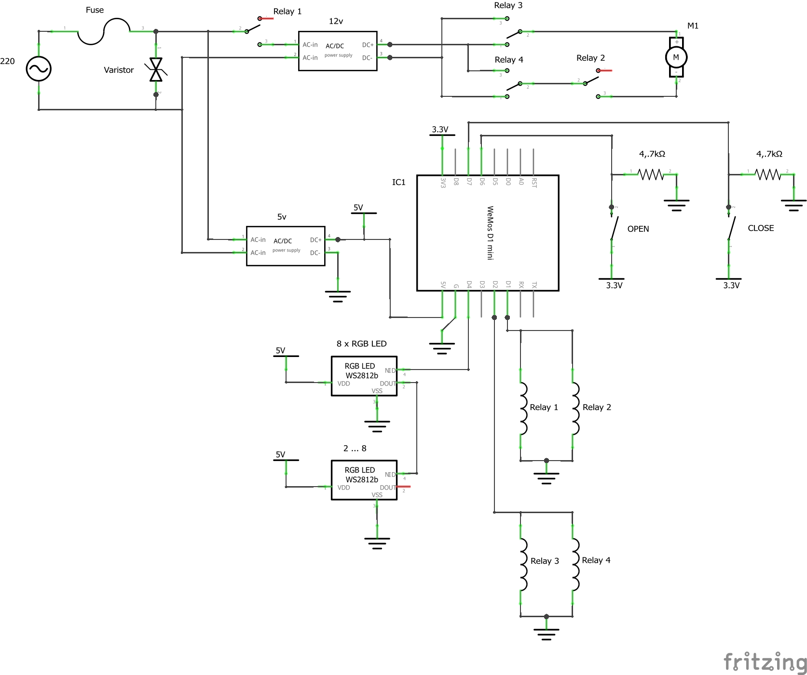
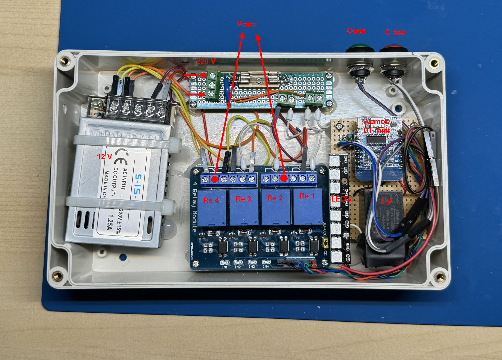
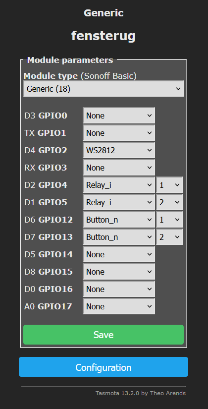
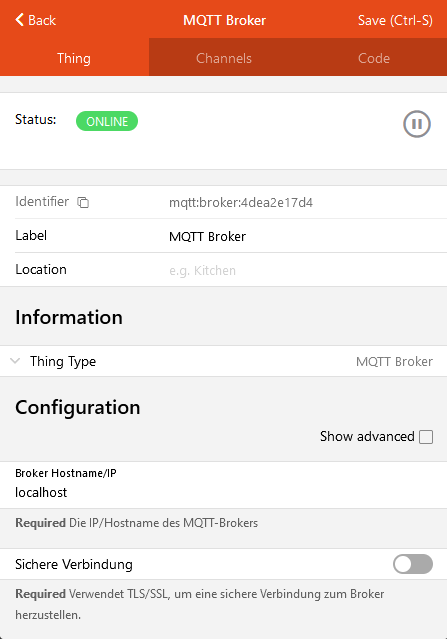
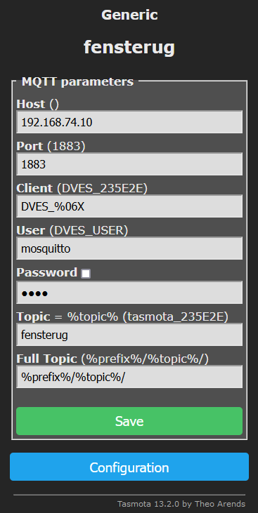
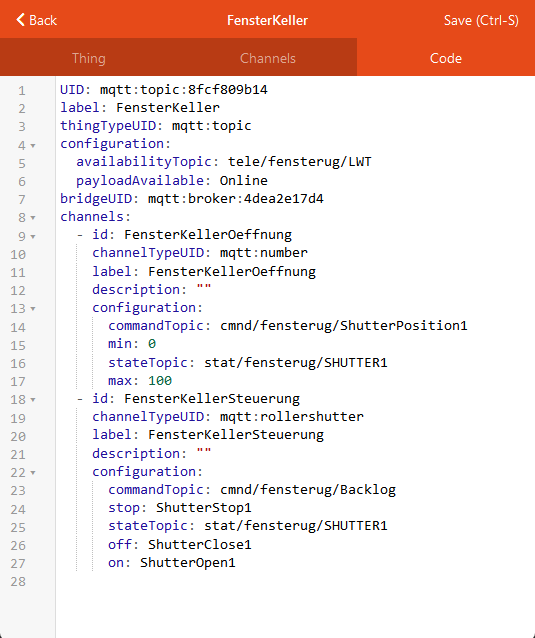
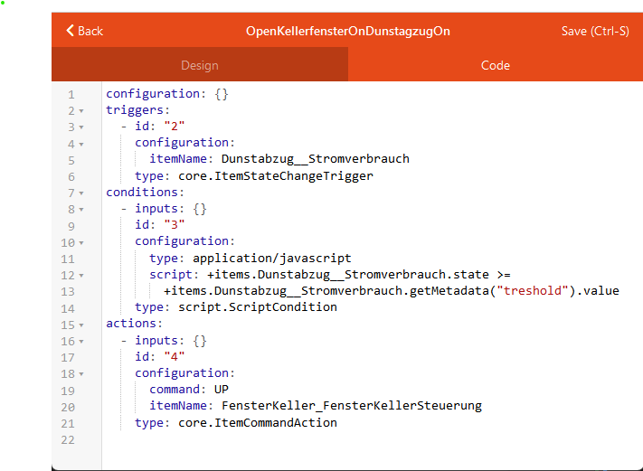
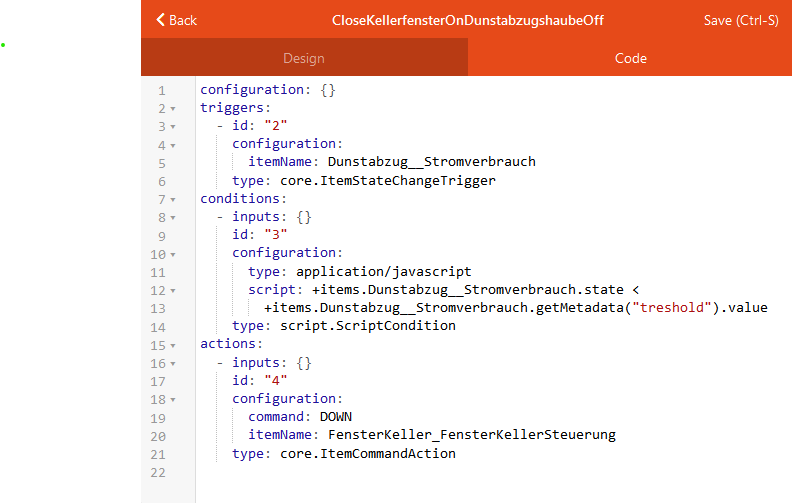

# Tasmota based window actuator
This project implements a [tasmota](https://tasmota.github.io) based windows actuator.

The implementation allows steer the window both directly using buttons and remotely over the functionalities provided by tasmota (MQTT, HTTT, Web UI).

I integrated the actuator into my [OpenHab](https://www.openhab.org/) environment, which is also described below.

## Circuit Diagram



### Relay 1
Powers the 12v power supply only if needed

### Relay 2
Switch on/off the motor. The Relay 1 is not enough as the remaining energy of the power supply continues to power the motor even if the power supply by itself is cut off the current. So Relay 2 ensures immediate stop of the motor.

### Relays 3 and 4 
Are the classic power polarity inverting circuit. Together they let the motor turn into the one or another direction.

### Push Buttons "OPEN" and "CLOSE"
The buttons are implemented with the pull-up resistors.

### 8 x RGB LED WS2512b (optional)
This is an optional/changeable component to visualize the current status of the window.
In the presented implementation it is a stripe of 8 RGB LEDs.

### Fuse and Varistor
Shall protect the circuit.

### Motor
I used a linear actuator for 12v

### WeMos D1 mini
Is the "Brain" of the circuit.

## Assembly



## Tasmota Configuration

### Module Configuration



### Settings and Rules

#### Motor and Buttons
Configure motor and button functionality using the tasmota build-in shutter&blinds support:
```
Backlog SetOption80 1; ShutterRelay1 1; ShutterMode 2; Interlock OFF; ShutterButton1 2 up 0; ShutterButton1 1 down 0; ShutterCloseDuration1 23; ShutterOpenDuration1 23
```

#### LED's (Optional)
Configure LED's to show the open/close status but also the opening/closing progress:
```
Rule1
	on system#boot do backlog led1 000000; led2 000000; led3 000000; led4 000000; led5 000000; led6 000000; led7 000000; led8 000000 endon
	ON Shutter1#Position=0 DO backlog led1 100000; led2 000000; led3 000000; led4 000000; led5 000000; led6 000000; led7 000000; led8 000000 endon
	ON Shutter1#Position=100 DO backlog delay 1; led1 000000; led2 000000; led3 000000; led4 000000; led5 000000; led6 000000; led7 000000; led8 001000 endon
	ON Shutter1#Position>=15 DO led2 050500 endon
	ON Shutter1#Position<15 DO led2 000000 endon
	ON Shutter1#Position>=30 DO led3 050500 endon
	ON Shutter1#Position<30 DO led3 000000 endon
	ON Shutter1#Position>=45 DO led4 050500 endon
	ON Shutter1#Position<45 DO led4 000000 endon	
	ON Shutter1#Position>=60 DO led5 050500 endon
	ON Shutter1#Position<60 DO led5 000000 endon
	ON Shutter1#Position>=75 DO led6 050500 endon
	ON Shutter1#Position<75 DO led6 000000 endon
	ON Shutter1#Position>=90 DO led7 050500 endon
	ON Shutter1#Position<90 DO led7 000000 endon

Rule1 1
```

## Integration Into OpenHab

### OpenHab
First of all you need a local [OpenHab](https://www.openhab.org/) server.

### MQTT Broker
The second prerequisite is a MQTT Broker. I installed the [Mosquitto](https://mosquitto.org/)

### Integrate MQTT Broker into OpenHab
1. Add the MQTT Binding Add-on to you OpenHab
2. Configure the MQTT Broker connection



### Configure Tasmota to interact with the MQTT Broker


### Integrate the Window Actor over the MQTT Broker into OpenHab


Here 2 channels are integrated:
- Information Channel providing the info about opening status of the window actor
- Command Channel allowing sending open/close commands

For the command channel a workaround over the Backlog command is used allowing sending the tasmota console commands over this channel.

### Use the Windows Actor in the OpenHab rules
After the connection between OpenHab and the Windows Actor is configured it can be used in the OpenHab rules to react to events like pressing virtual buttons or to some other events like, in my case, to switching on/off of the haze extractor hood:



Here if the power consumption of the extractor hood exceeds the specified threshold value the command "UP" is send to the `cmnd/fensterug/Backlog` topic of the Windows Actor resulting the opening of the window.

The opposite rule looks like following:

